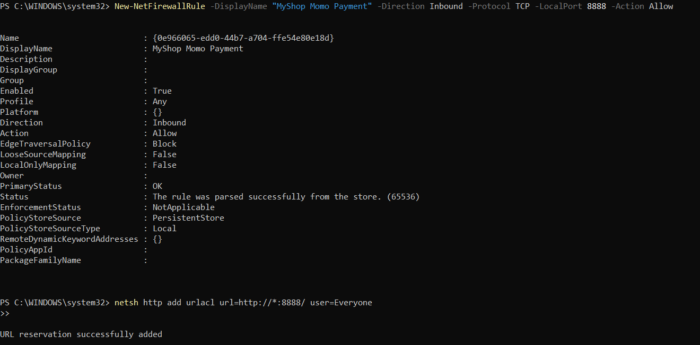
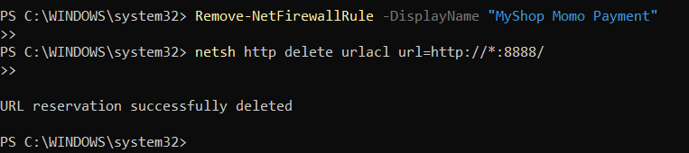

# MyShopPlugin - Advanced Search Plugin

A WinUI 3 plugin with **pure C# UI** (no XAML) for advanced product filtering.

## Quick Setup (After Cloning)

### Prerequisites
- .NET 8 SDK
- Visual Studio 2022 (or VS Code with C# extension)
- Windows 10/11

### Build Steps

```bash
# 1. Navigate to plugin directory
cd Plugins\MomoPayment

# 2. Restore packages
dotnet restore

# 3. Build plugin (x64 platform)
dotnet build -c Debug -p:Platform=x64

# 4. Plugin auto-copies to MyShop/bin/.../Plugins/
```

### Verify Installation

```bash
# Check if plugin DLL exists
dir ..\MyShop\bin\x64\Release\net8.0-windows10.0.19041.0\win-x64\AppX\Plugins\FuzzySearch.dll
```

---

## Cấu hình Firewall (Test QR thật)

Để điện thoại có thể kết nối đến máy tính qua mã QR, cần mở port 8888:

### Mở Port (PowerShell với quyền Admin):
```powershell
# 1. Thêm Firewall rule
New-NetFirewallRule -DisplayName "MyShop Momo Payment" -Direction Inbound -Protocol TCP -LocalPort 8888 -Action Allow

# 2. Cho phép HttpListener bind port (quan trọng!)
netsh http add urlacl url=http://*:8888/ user=Everyone
```


Sau đó **restart App** để áp dụng.

### Đóng Port sau khi test (khuyến nghị):
```powershell
Remove-NetFirewallRule -DisplayName "MyShop Momo Payment"

netsh http delete urlacl url=http://*:8888/
```



### Test nhanh (Dev Mode)
Nếu không muốn cấu hình Firewall, dùng nút **"Giả lập đã quét (Dev Mode)"** trong dialog QR.
